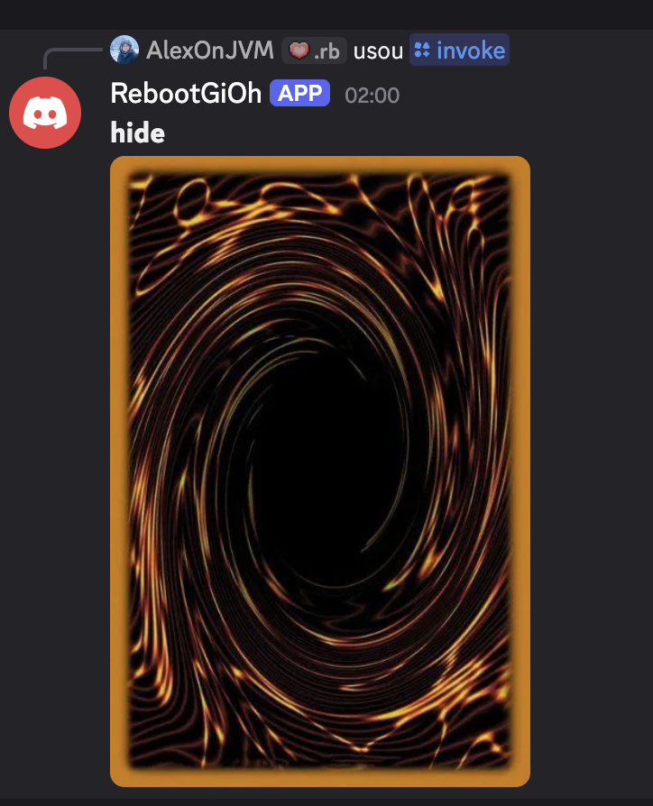

Implemente a API como você quiser, mas ela deve ser capaz de receber um JSON com a seguinte estrutura:

GET /deck/identifier

```json
{
  "card_url": "string"
}
```

Após instalar o Bot, você faz /register

Coloca o Host do seu servidor feito em qualquer porcaria de linguagem que vc gosta

e depois você faz /invoke teu-identificador

